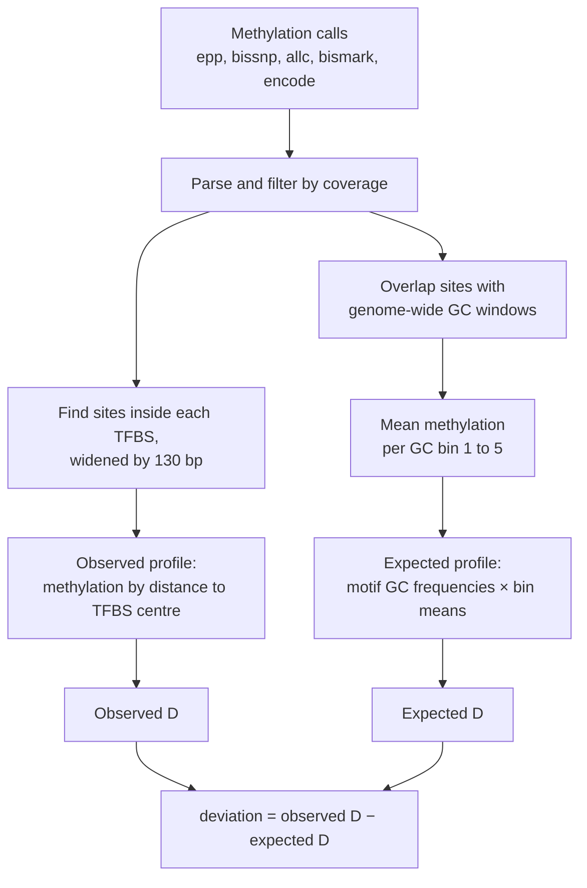
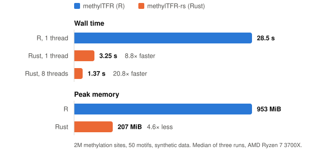

# methylTFR-rs

A Rust port of the computational core of [methylTFR](https://github.com/EpigenomeInformatics/methylTFR),
the R/Bioconductor package that scores DNA methylation footprints at
transcription factor binding sites.

It reads the same six methylation call formats, does the same arithmetic, and
agrees with the R package to about 13 decimal places. On a 2M-site benchmark it
is about 9× faster on one thread and uses a fifth of the memory.

> Status: the core calculation is ported and verified against methylTFR 0.99.9.
> It has been tested on the package's bundled example and on synthetic data, not
> yet on a real whole-genome methylome. Plotting, statistics and the
> Bioconductor object layer are out of scope; see [Scope](#scope).

## What it computes

For each sample and motif, methylTFR asks: is methylation at the centre of this
factor's binding sites lower or higher than in the flanks, beyond what GC
content alone would predict?



`D` compares the middle of a profile with its edges. Positions are cut into five
intervals between −250 and +250 bp, each interval is averaged, and
`D = middle / mean(first, last)`. A value below 1 means the binding site is less
methylated than its surroundings. Subtracting the expected `D` removes the part
of that signal explained by GC content.

## Usage

```sh
cargo build --release

target/release/methyltfr run \
    --format bismarkcov \
    --annotation tests/fixtures/batf \
    sample_1.cov
```

```
sample,motif,deviation,expected_deviation
sample_1.cov,BATF,1.7474268004931508,0.9798459267795762
```

The annotation directory holds `gc_windows.tsv` and a `motifs.tsv` manifest
pointing at one TFBS file and one GC-frequency matrix per motif.
`scripts/export_reference_data.R` converts methylTFR's `.rda` objects into these
plain TSV files. Other flags: `--motif`, `--enhancer`, `--strand-aware`,
`--cov-threshold`, `--keep-going`, `-o`.

## Parity with the R package

Parity came first; nothing was optimised until it held. Everything is checked
against methylTFR 0.99.9 at commit
[`8aeab03`](https://github.com/EpigenomeInformatics/methylTFR/commit/8aeab03cb469a9c213b7cd7fd2cbe6eeb8db5856).

| Check | Result |
|---|---|
| Bundled BATF example (two fixture revisions) | differs from R by 2.2e-16, i.e. the last bit |
| 200 randomized cases generated and scored by R | worst absolute error 1.3e-13, worst relative 6.0e-12 |
| Error behaviour | all 23 cases where R raises an error also fail in Rust |
| Parsers, six formats | scores and coverage bit-identical to `read_methylome()` |
| R numeric primitives (`round`, `seq`, `cut`) | bit-identical on R-generated tables |
| 50-motif, 2M-site benchmark output | worst absolute difference from R 4.4e-16 |
| 1, 2, 4, 8 and 16 threads | output files byte-identical |

The output is not byte-identical to R's, and is not meant to be: R sums in
extended precision and multiplies matrices through BLAS, so the last digit or
two can differ. Across thread counts the Rust output *is* byte-identical,
because parallelism is over motifs and never reorders a sum.

Getting this close meant reproducing R behaviour that is easy to get wrong:

- `round(x, 6)` is not `(x * 1e6).round() / 1e6`. R gives `1/128 → 0.007812`;
  the naive version gives `0.007813`.
- `round()` goes half-to-even, which decides TFBS midpoints whenever the window
  width is even.
- The expected profile has no position 0 when its length is even.
- A methylation site spanning two GC windows is counted in both.

The three places where the port knowingly differs are listed in
[`docs/divergences.md`](docs/divergences.md).

## Performance

Measured on an AMD Ryzen 7 3700X (8 cores, 16 threads); median of three runs,
wall time and peak RSS from `/usr/bin/time`. Inputs are synthetic.

**Against R** — 2M sites, 50 motifs. R is methylTFR 0.99.9 calling
`computeDeviation` once per motif on a single thread.

<picture>
  <source media="(prefers-color-scheme: dark)" srcset="docs/img/benchmark-dark.svg">
  
</picture>

| | Wall time | Speed-up | Peak memory |
|---|---|---|---|
| methylTFR (R), 1 thread | 28.5 s | 1.0× | 953 MiB |
| methylTFR-rs, 1 thread | 3.25 s | 8.8× | 207 MiB |
| methylTFR-rs, 8 threads | 1.37 s | 20.8× | 207 MiB |

**Thread scaling** — 28M sites, 7.7M GC windows, 500 motifs × 250k binding sites.

| Threads | Wall time | Speed-up |
|---|---|---|
| 1 | 499 s | 1.0× |
| 2 | 265 s | 1.9× |
| 4 | 151 s | 3.3× |
| 8 | 93 s | 5.4× |
| 16 | 78 s | 6.4× |

Peak memory is 5.4 GB at every thread count. Not yet measured: R on the 28M-site
dataset, and R with multiple workers.

## How it was built

This port was written with AI models, with me directing and checking the work.
The workflow was the interesting part:

1. **Read the source, not the docs.** A large model read the R implementation
   and re-ran the bundled example in plain R before any Rust existed. That
   surfaced the rounding rules above, and showed that the "expected" numbers in
   the published vignette were stale: the example data had changed after the
   vignette was rendered.
2. **Write a spec a small model can follow.** The findings became
   [`docs/AGENT_PLAN.md`](docs/AGENT_PLAN.md): every rule stated in Rust terms,
   split into small tasks, each with one command that proves it is done.
3. **Let R be the judge.** Test expectations are never typed by hand. R
   generates them, they are committed, and CI runs Rust alone against them.
4. **Hand implementation to a smaller model.** It worked through the tasks:
   numeric primitives first, then intervals, the core, parsers, CLI, and the
   200-case differential suite.
5. **Verify independently.** The large model re-ran the full test suite and
   re-did the benchmarks on a quiet machine, discarding an earlier set taken
   while another job was loading the CPU.

The rule that made it work: the models were not allowed to change a tolerance,
a fixture or an expected value to make a test pass.

## Scope

Ported: methylome parsing, GC-bin means, expected profiles, TFBS matching,
deviation, enhancer restriction, strand-aware mode, CLI.

Not ported: plotting, the `methylTFRdeviations` object and its z-scores,
differential testing, variability ranking, RnBeads input, AnnotationHub. The
annotation packages are not redistributed here.

## Development

```sh
cargo fmt --check
cargo clippy --all-targets -- -D warnings
cargo test --release        # 189 tests
```

## Credits and licence

methylTFR is by Irem B. Gündüz, Sarath Kumar Murugan and Fabian Mueller
(Epigenome Informatics), MIT licensed. This port contains none of its source
code; the test fixtures are derived from its example data. See [`NOTICE`](NOTICE).

methylTFR-rs is released under the [MIT licence](LICENSE).
