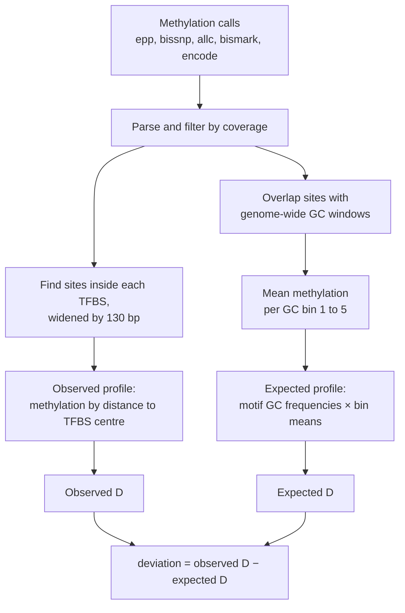
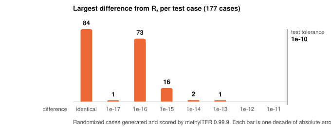
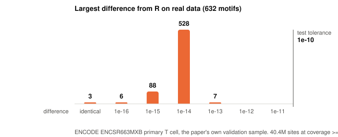
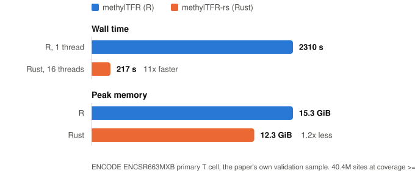
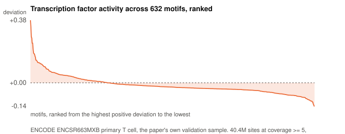
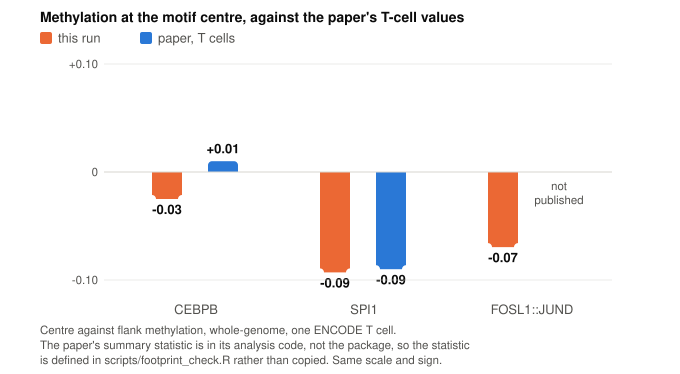
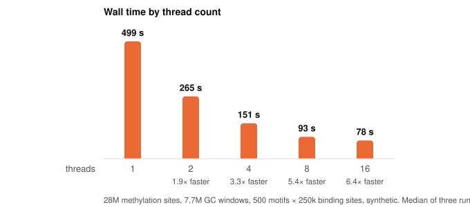

# methylTFR-rs

A Rust port of the computational core of [methylTFR](https://github.com/EpigenomeInformatics/methylTFR),
the R/Bioconductor package that scores DNA methylation footprints at
transcription factor binding sites.

It reads the same six methylation call formats, does the same arithmetic, and
agrees with the R package to about 13 decimal places. On a real whole-genome
methylome it is 10.7× faster than R and uses less memory; on a 2M-site benchmark
it is about 9× faster on one thread.

> Status: the core calculation is ported and verified against methylTFR 0.99.9.
> It has been tested on the package's bundled example, on synthetic data, and on
> a real whole-genome T-cell methylome — one of the four ENCODE samples the
> methylTFR paper itself validates on — against the published hg38 JASPAR2020
> annotation. See [Real data](#real-data). Plotting, statistics and the
> Bioconductor object layer are out of scope; see [Scope](#scope).

## What it computes

For each sample and motif, methylTFR asks: is methylation at the centre of this
factor's binding sites lower or higher than in the flanks, beyond what GC
content alone would predict?



`D` compares the middle of a profile with its edges. Positions are cut into five
intervals between −250 and +250 bp, each interval is averaged, and
`D = middle / mean(first, last)`. A value below 1 means the binding site is less
methylated than its surroundings. Subtracting the expected `D` removes the part
of that signal explained by GC content.

## Usage

```sh
cargo build --release

target/release/methyltfr run \
    --format bismarkcov \
    --annotation tests/fixtures/batf \
    sample_1.cov
```

```
sample,motif,deviation,expected_deviation
sample_1.cov,BATF,1.7474268004931508,0.9798459267795762
```

The annotation directory holds `gc_windows.tsv` and a `motifs.tsv` manifest
pointing at one TFBS file and one GC-frequency matrix per motif.
`scripts/export_reference_data.R` converts methylTFR's `.rda` objects into these
plain TSV files. Other flags: `--motif`, `--enhancer`, `--strand-aware`,
`--cov-threshold`, `--keep-going`, `-o`.

## Parity with the R package

Parity came first; nothing was optimised until it held. Everything is checked
against methylTFR 0.99.9 at commit
[`8aeab03`](https://github.com/EpigenomeInformatics/methylTFR/commit/8aeab03cb469a9c213b7cd7fd2cbe6eeb8db5856).

<picture>
  <source media="(prefers-color-scheme: dark)" srcset="docs/img/parity-dark.svg">
  
</picture>

Of 177 randomized cases scored by R, 84 match in every digit of every value and
the worst differs by 1.3e-13. The other checks:

- **Bundled BATF example:** differs from R by 2.2e-16, the last bit.
- **Error behaviour:** all 23 further cases where R raises an error also fail in Rust.
- **Parsers, six formats:** scores and coverage bit-identical to `read_methylome()`.
- **R numeric primitives** (`round`, `seq`, `cut`): bit-identical on R-generated tables.
- **1 to 16 threads:** output files byte-identical.

The output is not byte-identical to R's, and is not meant to be: R sums in
extended precision and multiplies matrices through BLAS, so the last digit or
two can differ. Across thread counts the Rust output *is* byte-identical,
because parallelism is over motifs and never reorders a sum.

Getting this close meant reproducing R behaviour that is easy to get wrong:

- `round(x, 6)` is not `(x * 1e6).round() / 1e6`. R gives `1/128 → 0.007812`;
  the naive version gives `0.007813`.
- `round()` goes half-to-even, which decides TFBS midpoints whenever the window
  width is even.
- The expected profile has no position 0 when its length is even.
- A methylation site spanning two GC windows is counted in both.

The three places where the port knowingly differs are listed in
[`docs/divergences.md`](docs/divergences.md).

## Real data

Everything above is synthetic or bundled example data. This section is the same
comparison on a real published dataset, chosen because the methylTFR paper uses
it itself.

**The sample.** `ENCFF355UVU`, from ENCODE experiment `ENCSR663MXB`: a primary
human T cell, whole-genome bisulfite sequencing, GRCh38 bedMethyl, 58,607,924
CpG records. The paper's data availability section names four ENCODE methylomes
for its validation analysis — GM12878 (`ENCSR890UQO`), CD14+ monocytes
(`ENCSR017BUL`), B cells (`ENCSR284TCU`) and T cells (`ENCSR663MXB`) — and this
is the T-cell one, in the exact format and with the exact filter its methods
specify: *"ENCODE (GRCh38 bedMethyl, CpGs with coverage of at least 5)"*. That
filter leaves 40,410,035 sites.

**The annotation.** The published `methylTFRAnnotationHg38` objects (Zenodo record
22206980, CC-BY 4.0), the same ones the authors use: 632 JASPAR2020 motifs,
263,425,993 binding sites, 102,942,317 GC windows. `scripts/export_real_annotation.R`
converts them to the CLI's TSV directory, and
`scripts/verify_real_annotation.R` then checks the conversion back against the
originals — 1,904 checks, every GC-frequency value compared at 17 significant
digits, every GC-window column over all 102.9M rows. Both implementations
therefore solve the same problem, not two nearly identical ones.

**Agreement.** All 632 motifs, worst case 1.428e-13 against a tolerance of
1e-10. Only 3 motifs match R in every digit, which is expected and not a
regression: a single motif here averages millions of methylation calls, so the
extended-precision difference R introduces has far more places to accumulate
than it did on the small randomized cases. The magnitude is the same 1e-13.

<picture>
  <source media="(prefers-color-scheme: dark)" srcset="docs/img/realparity-dark.svg">
  
</picture>

**Speed and memory**, single run each, `/usr/bin/time`, Rust on all 16 threads.

<picture>
  <source media="(prefers-color-scheme: dark)" srcset="docs/img/realbench-dark.svg">
  
</picture>

The memory gap is much narrower here than on the 2M-site benchmark, and for a
good reason: both programs now hold the annotation. Rust keeps every motif's
binding sites resident, and at 32 bytes per interval those 263.4M sites are
8.4 GB of the 13.3 GB the run accounts for, alongside 3.3 GB of GC windows and
1.6 GB of methylation sites. The synthetic benchmark's 5× gap is the one to
expect on a workload with a smaller annotation.

**The result**, which is the point of running on real data at all: 632
transcription factor activity scores from an actual T cell.

<picture>
  <source media="(prefers-color-scheme: dark)" srcset="docs/img/realresult-dark.svg">
  
</picture>

### The paper's own numbers come out

The strongest available check is whether this setup reproduces a result the
authors published. Their Figure 2E reports one number per motif per cell type
from the aggregate methylation profile around motif occurrences; for T cells it
gives CEBPB `0.01` ("unchanged") and SPI1 `-0.09` (mildly depleted), and notes
that FOSL1::JUND is depleted in all four populations.

`scripts/footprint_check.R` asks the reference build that question directly.
Their summary statistic is in their analysis code rather than in the package, so
the script uses a plainly defined one on the same scale — mean methylation in
the middle interval against the mean of the two outer intervals, minus one, over
the same five position intervals methylTFR's own arithmetic uses — and says so
in its output. It is whole-genome, not restricted to the distal regions the paper
uses, and it is one ENCODE sample rather than the paper's BLUEPRINT population.

<picture>
  <source media="(prefers-color-scheme: dark)" srcset="docs/img/footprint-dark.svg">
  
</picture>

SPI1 lands on the published value. CEBPB comes out slightly negative but small
enough to still read as "unchanged", which is what the paper says it is.
FOSL1::JUND is depleted, as reported, though the paper gives no single number for
it. Two independent published values coming out of a pipeline that was never
tuned on them is good evidence that the sample, the annotation and the arithmetic
are all right.

Reproducing the run needs no data in this repository. The sample and the
annotation are downloaded from ENCODE and Zenodo, and
[`docs/data/realdata_manifest.tsv`](docs/data/realdata_manifest.tsv) records every
accession and SHA-256:

```sh
Rscript scripts/export_real_annotation.R <annotation_dir> <out_dir> all
Rscript scripts/verify_real_annotation.R <annotation_dir> <out_dir>
Rscript scripts/bench_real_r.R <annotation_dir> <sample.bed.gz> r.csv all
target/release/methyltfr run --format encode --annotation <out_dir> \
    --cov-threshold 5 -o rust.csv <sample.bed.gz>
python3 scripts/realdata_report.py <run_dir>
python3 scripts/plot_readme_figures.py
```

## Performance

Measured on an AMD Ryzen 7 3700X (8 cores, 16 threads); median of three runs,
wall time and peak RSS from `/usr/bin/time`. Inputs are synthetic.

**Against R** — 2M sites, 50 motifs. R is methylTFR 0.99.9 calling
`computeDeviation` once per motif on a single thread.

<picture>
  <source media="(prefers-color-scheme: dark)" srcset="docs/img/benchmark-dark.svg">
  
</picture>

**Thread scaling** — 28M sites, 7.7M GC windows, 500 motifs × 250k binding sites.

<picture>
  <source media="(prefers-color-scheme: dark)" srcset="docs/img/scaling-dark.svg">
  
</picture>

Peak memory is 5.4 GB at every thread count. Scaling flattens past 8 threads,
the machine's physical core count. Not yet measured: R on the 28M-site
dataset, and R with multiple workers.

[Real data](#real-data) repeats the comparison on a published whole-genome
methylome, where R takes 38.5 minutes and Rust takes 3.6 minutes for the same
632 motifs.

## How it was built

This port was written with AI models, with me directing and checking the work.
The workflow was the interesting part:

1. **Read the source, not the docs.** A large model read the R implementation
   and re-ran the bundled example in plain R before any Rust existed. That
   surfaced the rounding rules above, and showed that the "expected" numbers in
   the published vignette were stale: the example data had changed after the
   vignette was rendered.
2. **Write a spec a small model can follow.** The findings became
   [`docs/AGENT_PLAN.md`](docs/AGENT_PLAN.md): every rule stated in Rust terms,
   split into small tasks, each with one command that proves it is done.
3. **Let R be the judge.** Test expectations are never typed by hand. R
   generates them, they are committed, and CI runs Rust alone against them.
4. **Hand implementation to a smaller model.** It worked through the tasks:
   numeric primitives first, then intervals, the core, parsers, CLI, and the
   200-case differential suite.
5. **Verify independently.** The large model re-ran the full test suite and
   re-did the benchmarks on a quiet machine, discarding an earlier set taken
   while another job was loading the CPU.

The rule that made it work: the models were not allowed to change a tolerance,
a fixture or an expected value to make a test pass.

## Scope

Ported: methylome parsing, GC-bin means, expected profiles, TFBS matching,
deviation, enhancer restriction, strand-aware mode, CLI.

Not ported: plotting, the `methylTFRdeviations` object and its z-scores,
differential testing, variability ranking, RnBeads input, AnnotationHub. The
annotation packages are not redistributed here.

## Development

```sh
cargo fmt --check
cargo clippy --all-targets -- -D warnings
cargo test --release        # 189 tests
```

## Credits and licence

methylTFR is by Irem B. Gündüz, Sarath Kumar Murugan and Fabian Mueller
(Epigenome Informatics), MIT licensed. This port contains none of its source
code; the test fixtures are derived from its example data. See [`NOTICE`](NOTICE).

The [Real data](#real-data) section uses `ENCSR663MXB` from ENCODE and the
`methylTFRAnnotationHg38` annotation from Zenodo record 22206980 (CC-BY 4.0).
Neither is redistributed here. The sample and the results drawn from the
methylTFR paper are cited as: Gündüz, Nitsch, Murugan and Mueller, *methylTFR:
Computational quantification of transcription factor activity from DNA
methylation*, bioRxiv [doi:10.64898/2026.09.29.755279](https://doi.org/10.64898/2026.09.29.755279).

methylTFR-rs is released under the [MIT licence](LICENSE).
